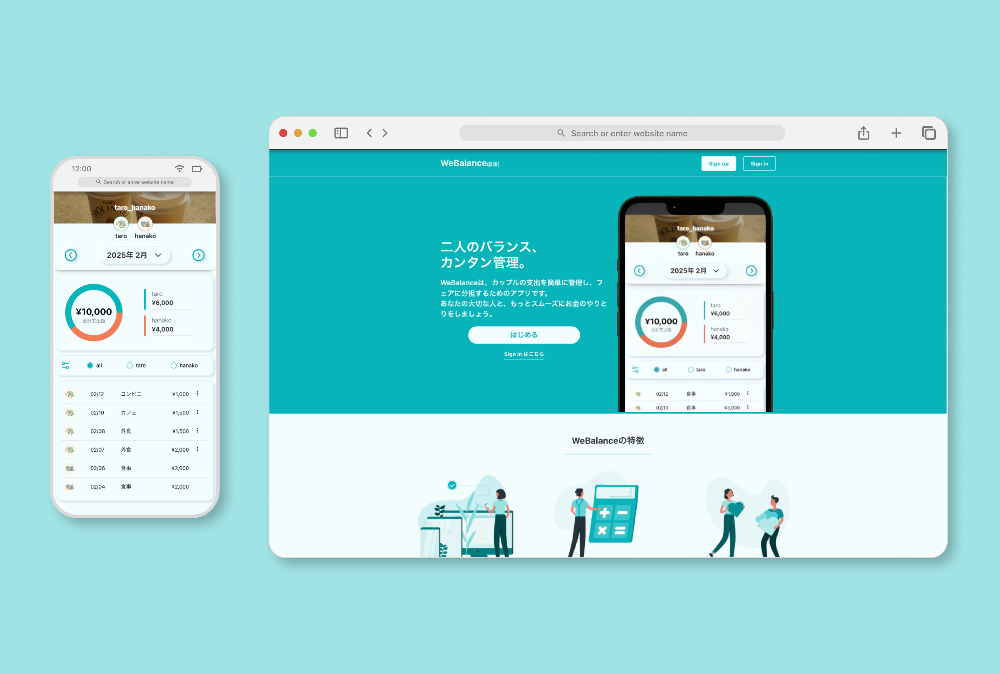

# WeBalance

カップル向け家計管理アプリ。リアルタイムで共有支出を管理でき、モバイルファーストデザインで構築。  
https://webalance.vercel.app/



## 技術スタック

- **フレームワーク:** Next.js 16（App Router, Turbopack, React 18）
- **言語:** TypeScript（strict mode）
- **スタイリング:** Tailwind CSS + shadcn/ui（New Yorkスタイル）
- **バックエンド/認証:** Supabase（PostgreSQL、Email OTP認証、Realtime）
- **フォーム:** React Hook Form + Zod
- **アニメーション:** Framer Motion
- **チャート:** Recharts
- **通知:** react-hot-toast

## セットアップ

### 前提条件

- Node.js 20+
- npm
- Supabaseプロジェクト

### 環境変数

`.env.local` を作成し、以下を設定:

```env
NEXT_PUBLIC_SUPABASE_URL=
NEXT_PUBLIC_SUPABASE_ANON_KEY=
NEXT_PUBLIC_APP_URL=
```

### インストール・起動

```bash
npm install
npm run dev
```

[http://localhost:3000](http://localhost:3000) で確認できます。

## コマンド

| コマンド | 説明 |
| --- | --- |
| `npm run dev` | 開発サーバー起動（Turbopack） |
| `npm run build` | 本番ビルド |
| `npm run start` | 本番サーバー起動 |
| `npm run lint` | ESLint実行 |

## ディレクトリ構成

```
app/
  (app)/    — メインのカップルダッシュボード・支出管理（認証必須）
  (form)/   — 認証フォーム（signin, signup, setup, password-reset）
  (home)/   — ランディングページ
  (other)/  — 利用規約、プライバシーポリシー
  auth/     — 認証コールバック（OTP検証）
components/
  ui/       — shadcn/ui コンポーネント
lib/        — ユーティリティ、カラー定義、Supabaseヘルパー
utils/
  supabase/ — Supabaseクライアントファクトリ（client/server）
```

## 実装のポイント

### リアルタイム同期

Supabase Realtimeを使い、支出データのINSERT/UPDATE/DELETEをリアルタイムで同期。Server Componentで初期データを取得し、Client ComponentがRealtimeチャンネルをサブスクライブするハイブリッド構成。

### 状態管理

React Contextを2つ使用してグローバル状態を管理:
- **CoupleContext** — ユーザー・パートナー・カップル情報
- **ExpensesContext** — 支出データ（Realtimeリスナー付き）

### 認証

Email OTPによるパスワードレス認証。Supabase SSRでサーバーサイドセッション管理を行い、レイアウトレベルで認証チェック。

### モバイルファースト

max-width 430pxを基準としたモバイルファーストデザイン。カスタムテーマカラー（primary: `#07B4BA`, secondary: `#F17C55`）で統一感のあるUIを実現。

### 動的ルーティング

`[coupleId]/[yearMonth]` セグメントにより、カップルごと・月ごとの支出データを表示。URLで状態を管理することでブックマークや共有が可能。
